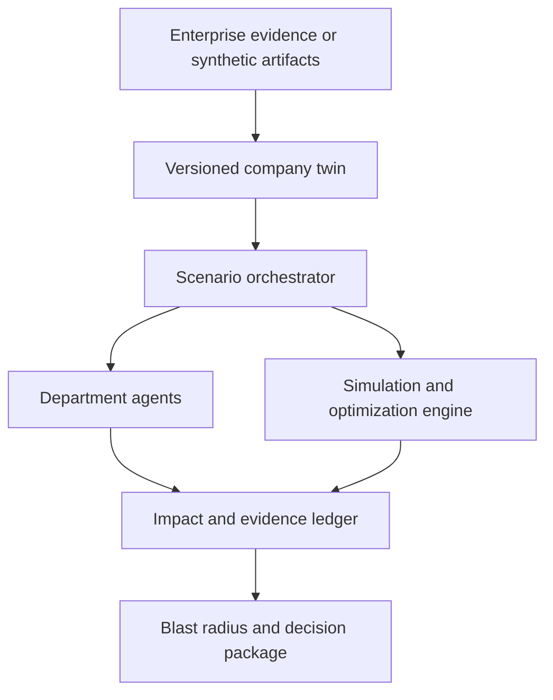

# Canary Pact — Master Implementation Plan

**Product:** AI-powered organizational decision simulator  
**Core metaphor:** A flight simulator for company decisions  
**Primary demo:** Reduce $2B from seven data vendors costing $8B  
**Secondary proof:** Detect two workflows stranded by removing eight staff roles  
**Primary principle:** Agents reason; deterministic code calculates; humans decide.

---

## 1. Product definition

Canary Pact creates a decision-relevant digital twin of a company. The twin represents departments, people and roles, institutional knowledge, workflows, systems, vendors, datasets, policies, customers, business metrics, and the dependencies between them.

When leadership proposes a decision, Canary Pact:

1. freezes and versions the current company state;
2. creates isolated simulated futures;
3. routes the decision to affected department agents;
4. asks each agent to identify impacts, edge cases, risks, and missing information from its departmental perspective;
5. validates those claims against the shared company twin;
6. propagates effects across departments, workflows, systems, customers, and KPIs;
7. compares acting now, not acting, delaying, and alternative interventions;
8. recommends the feasible plan with the best company-wide outcome;
9. produces a traceable decision package with evidence, confidence, mitigations, monitoring, and rollback conditions.

### Core question

> If the company makes this decision, what is the complete organizational blast radius, what could fail, and what alternative achieves the objective with less damage?

### Product boundary

Canary Pact is a decision-support system. It does not autonomously terminate employees, cancel contracts, transfer money, or execute organizational changes. Human decision owners retain approval authority.

### What makes it distinct

Canary Pact is not:

- a spend dashboard that ranks expenses by price;
- an org-chart product that counts headcount;
- several AI personas conducting an unstructured debate;
- an LLM-generated consulting report;
- a deterministic optimizer that ignores departmental edge cases;
- an oracle claiming to predict the future precisely.

It combines:

- a shared company digital twin;
- evidence-backed dependencies;
- specialized department agents;
- deterministic impact propagation;
- counterfactual scenario comparison;
- constrained portfolio optimization;
- uncertainty and sensitivity analysis;
- human authorization and auditability.

---

## 2. Non-negotiable scope

The implementation must preserve these ideas from the main plan:

1. The company digital twin is the central product.
2. Departments are represented by specialized agents.
3. Agents inspect the same shared company state but receive permission-filtered departmental views.
4. The system reveals direct, dependent, second-order, delayed, and feedback effects.
5. The primary scenario uses seven data vendors with $8B in spend and a $2B reduction target.
6. The system calculates vendor overlap and tests all 128 keep/remove portfolios.
7. The secondary scenario exposes institutional-knowledge loss and stranded workflows.
8. Numerical results and hard constraints come from deterministic code.
9. Agent claims are structured, traceable, and challengeable.
10. A human approves or rejects the final recommendation.

### Enhancements adopted from the supporting plans

- Multi-dimensional vendor overlap rather than one overlap score
- Gross savings versus displaced cost versus net value
- Evidence references on graph edges and agent claims
- “Act now,” “do not act,” and “delay” futures
- Quick deterministic simulation for agent tools and full uncertainty simulation for final results
- Mitigation re-simulation
- Item-level counterfactuals
- Sensitivity-based missing-question selection
- Saved run events and deterministic replay
- Mock-first parallel development
- Frozen JSON contracts in Hour 0
- A planted ground-truth graph for evaluation
- Explicit honest limitations

### Ideas intentionally not adopted

| Excluded idea | Reason |
|---|---|
| 3D office and avatars | Adds visual and integration risk without improving the decision engine |
| Long free-form agent debate | Slow, expensive, difficult to validate, and distracts from the twin |
| Person-level “fire/retain” recommendations | Creates ethical, legal, and product-positioning risk |
| Autonomous execution | Human approval must remain mandatory |
| Real enterprise integrations during the hackathon | Synthetic evidence is sufficient to prove the architecture |
| Full-fidelity replica of every company operation | The MVP is a decision-relevant twin, not a perfect corporate simulation |

---

## 3. User and business workflow

### Primary users

- CFO and FP&A teams
- COO and transformation offices
- Strategy and corporate-development teams
- Procurement and vendor-management teams
- CIO, CTO, and enterprise data leadership
- Business-unit executives

### End-to-end user journey

1. The user opens the current company twin.
2. The user enters a decision, objective, deadline, and hard constraints.
3. Canary Pact validates the brief and shows what information it will use.
4. The platform creates three default futures:
   - act now;
   - do not act;
   - delay action.
5. Candidate alternatives are generated.
6. Relevant department agents analyze each alternative.
7. The propagation engine calculates the organizational blast radius.
8. The optimizer filters infeasible alternatives and ranks the remainder.
9. The challenger identifies missed dependencies and unsupported assumptions.
10. The system asks the highest-value missing question, if needed.
11. The user answers and affected calculations are re-run.
12. The platform generates a decision package.
13. An authorized human approves, rejects, or requests another scenario.
14. The decision and its exact inputs are recorded in the audit log.

---

## 4. Demonstration scenarios

## 4.1 Primary scenario: data-vendor consolidation

### Decision brief

> Reduce annual external-data spending from $8B to no more than $6B without breaking compliance, reducing critical data coverage below 100%, reducing sales performance by more than 3%, or creating unacceptable customer impact.

### Synthetic vendor portfolio

| Vendor | Cost | Main contribution | Important overlap | Main consumers |
|---|---:|---|---|---|
| ApexData | $1.6B | Company and contact attributes | Beacon, Echo | Sales, Marketing |
| BeaconIQ | $1.2B | Contact enrichment and firmographics | Apex | Sales |
| CinderSignals | $1.4B | Purchase-intent signals | Echo | Marketing, Sales |
| DeltaVerify | $0.9B | Identity and compliance verification | Low; critical | Risk, Compliance |
| EchoMarket | $1.1B | Market and account intelligence | Apex, Cinder | Strategy, Marketing |
| FluxBehavior | $0.8B | Behavioral and product-usage signals | Low | Product, AI/Data |
| GraniteGeo | $1.0B | Geographic and macroeconomic risk | Delta | Operations, Risk |

Total synthetic spend: **$8.0B**.

### Required system behavior

- Calculate all 128 keep/remove combinations.
- Reject portfolios with less than $2B gross savings.
- Recalculate coverage, quality, freshness, permitted use, and critical attributes.
- Identify departments, workflows, systems, models, controls, and KPIs affected.
- Separate gross savings, termination cost, migration cost, displaced work, business loss, and net value.
- Compare the naive plan with the recommended plan.
- Show act-now, do-nothing, and delay futures.
- Produce a transition plan and stop/rollback conditions.

### Multi-dimensional overlap

Every vendor pair is compared across:

- entity or record coverage;
- fields and attributes;
- geographic coverage;
- historical depth;
- freshness;
- accuracy;
- licensing and permitted use;
- consumer-team overlap;
- downstream workflow overlap;
- model-feature overlap;
- substitutability and migration difficulty.

Two vendors are not considered substitutes merely because they contain the same accounts.

### Expected demonstration insight

The obvious plan may remove the most expensive vendor. The recommended plan should instead demonstrate that:

- ApexData has high company-wide marginal value;
- DeltaVerify is compliance-critical;
- BeaconIQ and EchoMarket have lower unique contribution after overlap;
- removing BeaconIQ and EchoMarket saves $2.3B before transition costs;
- a small set of unique EchoMarket attributes must be migrated first;
- the plan stays within the sales, customer, and compliance constraints.

The result must be produced from the dataset and engine, not inserted only as presentation text.

## 4.2 Secondary scenario: knowledge-loss and stranded workflows

### Decision brief

> Evaluate the operational consequences of eliminating eight staff roles that currently support two workflows.

### Required system behavior

- Model people as anonymized tokens, roles, skills, knowledge assets, backup coverage, and recent workflow activity.
- Show which procedures lose all capable owners.
- Detect two workflows that become stranded.
- Calculate documentation gaps, training time, replacement cost, recovery-time risk, and customer/service consequences.
- Avoid ranking named people or recommending who should be fired.
- Recommend workflow-level mitigations:
  - retain required role capacity temporarily;
  - document exception handling;
  - train backup owners;
  - shadow workflow execution;
  - automate repeatable steps;
  - stage the change after readiness gates pass;
  - obtain equivalent savings from lower-risk resources.
- Re-run the scenario after mitigations and show the risk reduction.

### Ethical output rule

The system may say:

> “Workflow B requires two independent qualified owners before this role reduction is operationally safe.”

It must not say:

> “Fire Person A and retain Person B.”

---

## 5. System architecture



### 5.1 Architectural rule

**The LLM reasons; code calculates.**

Agents may identify potential impacts, challenge assumptions, extract dependencies, and explain results. They may not calculate authoritative savings, override policies, invent entities, or select an infeasible plan.

### 5.2 Components

1. Evidence ingestion and normalization
2. Identity and alias resolution
3. Versioned company twin
4. Decision-brief parser
5. Scenario state manager
6. Dynamic agent router
7. Department agents
8. Agent-output validator and merger
9. Deterministic propagation engine
10. Vendor-overlap engine
11. Knowledge-risk engine
12. Baseline-pressure and time-horizon engine
13. Constraint and portfolio optimizer
14. Uncertainty and forecast engine
15. Mitigation engine
16. Sensitivity and missing-question selector
17. Explanation and decision-package generator
18. Event stream, replay, and audit log
19. Web dashboard

### 5.3 Recommended hackathon stack

- Python 3.11+
- FastAPI and Uvicorn
- Pydantic for all contracts
- NetworkX for the company graph
- NumPy for uncertainty sampling
- JSON files or SQLite for scenario state and audit records
- Next.js/React
- Cytoscape.js or React Flow for graph visualization
- Recharts or another simple chart library
- WebSockets or server-sent events for live progress
- One model provider behind a thin wrapper

### 5.4 Production evolution

- Graph database for large twins
- Event-sourced state and temporal graph history
- Workflow engine with retries and durable execution
- Enterprise data connectors
- Identity resolution across source systems
- Customer-cloud or isolated deployment
- Fine-grained authorization and source-permission inheritance
- Calibrated causal models and customer-specific coefficients
- Large-scale mathematical optimization
- Observed-versus-predicted outcome learning

---

## 6. Twin construction and evidence

### 6.1 Hackathon source artifacts

Use synthetic but realistic artifacts:

- vendor-contract summaries;
- data-catalog export;
- workflow inventory;
- system ownership file;
- model-feature registry;
- department and KPI definitions;
- runbooks and architecture notes;
- anonymized workflow activity;
- knowledge and backup-owner matrix;
- policy and compliance-control definitions.

### 6.2 Evidence-backed edges

Every inferred dependency edge stores:

- source entity;
- target entity;
- relationship type;
- strength;
- criticality;
- substitutability;
- time lag;
- confidence;
- evidence source and snippet;
- extraction method;
- last validation date.

### 6.3 AI extraction proof

The digital twin may be seeded from JSON for demo reliability, but include a narrow AI proof:

1. Give the system three to five noisy synthetic artifacts.
2. Extract selected entities, aliases, and dependency edges.
3. Compare the extracted edges against a hidden planted graph.
4. Display precision, recall, and F1 for:
   - simple keyword baseline;
   - zero-shot extraction;
   - Canary Pact extraction plus alias resolution.

This proves that AI helps construct the map rather than merely narrating a hard-coded graph.

### 6.4 Twin versioning

Every baseline and scenario must record:

- `twin_version`;
- `data_snapshot_id`;
- `policy_version`;
- `coefficient_version`;
- `agent_prompt_version`;
- `model_id`;
- `created_at`;
- `created_by`.

The baseline is immutable during a simulation. Each future is an isolated clone.

---

## 7. Core data model

### 7.1 Entities

- Organization
- Department
- PersonToken
- Role
- Skill
- KnowledgeAsset
- Procedure
- Workflow
- Project
- System
- Vendor
- Contract
- Dataset
- DataField
- Model
- CustomerSegment
- KPI
- Policy
- Control
- Decision
- Intervention
- Scenario
- Impact
- Mitigation
- Evidence

### 7.2 Relationships

- `OWNS`
- `WORKS_ON`
- `KNOWS`
- `BACKS_UP`
- `ENABLES`
- `MAINTAINS`
- `PROVIDES`
- `CONSUMES`
- `DEPENDS_ON`
- `SUPPORTS`
- `SUBSTITUTES_FOR`
- `CONTRIBUTES_TO`
- `SERVES`
- `CONSTRAINED_BY`
- `REQUIRES_CONTROL`
- `APPROVES`
- `AFFECTS`

### 7.3 Scenario state

```json
{
  "run_id": "run_2026_09_26_001",
  "decision_id": "dec_vendor_reduction",
  "baseline_twin_version": "twin_v12",
  "phase": "department_analysis",
  "active_scenario_ids": ["act_now", "inaction", "delay"],
  "candidate_plan_ids": [],
  "agent_assessments": [],
  "computed_impacts": [],
  "questions": [],
  "recommendation_id": null,
  "status": "running"
}
```

---

## 8. Frozen contracts

The team must freeze these contracts before parallel work begins. Any schema change after Hour 1 requires agreement from every owner.

### 8.1 Decision brief

```json
{
  "decision_id": "dec_vendor_reduction",
  "decision_type": "resource_reduction",
  "statement": "Reduce annual data-vendor spending by at least $2B.",
  "goal": {
    "metric": "annual_vendor_savings_usd",
    "target": 2000000000
  },
  "horizon_days": 365,
  "resource_scope": ["data_vendors"],
  "constraints": {
    "preserve_compliance": true,
    "minimum_critical_coverage_pct": 100,
    "maximum_sales_impact_pct": 3,
    "maximum_customer_impact_pct": 2
  },
  "futures": ["act_now", "inaction", "delay"]
}
```

### 8.2 Typed impact

```json
{
  "impact_id": "impact_102",
  "decision_id": "dec_vendor_reduction",
  "scenario_id": "act_now_plan_4",
  "source_entity": "vendor_echo",
  "affected_entity": "marketing_segmentation",
  "affected_department": "marketing",
  "level": "dependent",
  "direction": "decrease",
  "metric": "segment_coverage_pct",
  "magnitude": 4.2,
  "unit": "percent",
  "first_effect_day": 14,
  "peak_effect_day": 60,
  "reversibility": "medium",
  "confidence": 0.79,
  "dependency_path": [
    "vendor_echo",
    "account_intelligence",
    "marketing_segmentation"
  ],
  "evidence_refs": ["contract_echo_2", "catalog_edge_81"],
  "assumptions": ["ApexData retains company-level coverage"],
  "status": "computed"
}
```

### 8.3 Department-agent assessment

```json
{
  "agent": "operations",
  "scenario_id": "act_now_plan_4",
  "affected_entities": ["workflow_vendor_reconciliation"],
  "proposed_impacts": [],
  "failure_modes": ["unmatched records accumulate after schema changes"],
  "edge_cases": ["historical records remain licensed but refresh access ends"],
  "missing_dependencies": [],
  "questions": ["Who currently resolves schema exceptions?"],
  "objections": [],
  "assumptions": ["no replacement integration exists"],
  "evidence_refs": ["workflow_map_7", "incident_22"],
  "confidence": 0.82
}
```

### 8.4 Simulation result

```json
{
  "plan_id": "plan_beacon_echo",
  "future": "act_now",
  "interventions": ["remove_beacon", "remove_echo"],
  "gross_savings_usd": 2300000000,
  "termination_cost_usd": 90000000,
  "migration_cost_usd": 130000000,
  "displaced_cost_usd": 120000000,
  "expected_business_loss_usd": 0,
  "net_value_usd": 1960000000,
  "affected_departments": ["sales", "marketing", "engineering", "ai_data"],
  "constraint_violations": [],
  "orphaned_workflows": [],
  "impacts": [],
  "risk": {
    "score": 28,
    "p10_net_value_usd": 1700000000,
    "p50_net_value_usd": 1960000000,
    "p90_net_value_usd": 2100000000
  },
  "assumptions": [],
  "monitoring": [],
  "feasible": true
}
```

### 8.5 Event

```json
{
  "event_id": "evt_000123",
  "run_id": "run_2026_09_26_001",
  "sequence": 123,
  "type": "agent_assessment_completed",
  "actor": "operations",
  "scenario_id": "act_now_plan_4",
  "timestamp": "2026-09-26T16:10:00Z",
  "payload": {}
}
```

---

## 9. Orchestration state machine

The orchestrator is deterministic Python, not an LLM.

```text
VALIDATE BRIEF
      ↓
FREEZE BASELINE TWIN
      ↓
BUILD ACT / INACTION / DELAY FUTURES
      ↓
GENERATE AND VALIDATE CANDIDATE PLANS
      ↓
ROUTE TO AFFECTED DEPARTMENT AGENTS
      ↓
PARALLEL DEPARTMENT ANALYSIS
      ↓
VALIDATE AND MERGE STRUCTURED OUTPUTS
      ↓
DETERMINISTIC IMPACT PROPAGATION
      ↓
ONE CROSS-AGENT CHALLENGE ROUND
      ↓
CONSTRAINT FILTER + OPTIMIZATION
      ↓
FULL UNCERTAINTY RUN ON FINALISTS
      ↓
MISSING-FACT SELECTION
      ↓
OPTIONAL USER ANSWER + PARTIAL RE-RUN
      ↓
MITIGATION RE-SIMULATION
      ↓
DECISION PACKAGE + HUMAN APPROVAL
```

### 9.1 Dynamic routing

Define all department agents but run only those connected to the proposed decision through the graph.

Example:

- Vendor removal routes to Finance, Sales, Marketing, Operations, Engineering, AI/Data, Risk/Compliance, and Customer/Market.
- Workforce knowledge loss routes to Finance, People/Knowledge, Operations, Engineering, Risk/Compliance, and Customer/Market.

This preserves the department-agent concept without wasting time and tokens on irrelevant agents.

### 9.2 Parallel and serial stages

- Independent department assessments run in parallel.
- Output merging waits until the first pass completes.
- Deterministic propagation runs after merging.
- One challenge round is serially triggered from the merged blast radius.
- Final optimization runs only after challenges are resolved or labeled unresolved.

### 9.3 Convergence

Stop agent iteration after one challenge round for the hackathon. Production may stop when:

- no new severity-3-or-higher risk is found;
- no new dependency is proposed;
- no constraint status changes;
- candidate ranking remains unchanged;
- or a configured iteration limit is reached.

### 9.4 Orchestrator pseudocode

```python
async def run_decision(brief: DecisionBrief) -> DecisionPackage:
    validate_brief(brief)
    baseline = twin_store.freeze_current()
    run = create_run(brief, baseline.version)

    futures = scenario_factory.create_default_futures(brief, baseline)
    candidates = candidate_engine.generate(brief, baseline)
    candidates = deterministic_validator.filter_invalid(candidates, brief)

    for candidate in candidates:
        affected_agents = agent_router.select(candidate, baseline.graph)
        assessments = await run_agents_parallel(
            affected_agents,
            candidate,
            baseline.permission_filtered_views(),
        )
        validated = validate_agent_outputs(assessments, baseline)
        merged = merge_into_impact_ledger(validated)
        quick_result = simulation.quick(candidate, baseline, merged)
        run.record(candidate, quick_result)

    challenged = await challenger.review(run.top_candidates(3))
    run.merge_challenges(challenged)
    rerun_changed_candidates(run)

    feasible = constraints.filter(run.candidates, brief.constraints)
    ranked = optimizer.rank(feasible)
    finalists = simulation.full(ranked[:3], futures, seed=brief.seed)

    question = sensitivity.highest_value_question(finalists)
    mitigated = mitigation_engine.generate_and_resimulate(finalists[0])

    package = decision_package.build(
        brief=brief,
        baseline=baseline,
        futures=futures,
        finalists=finalists,
        question=question,
        mitigated=mitigated,
    )
    run.save_replay()
    return package
```

---

## 10. Department-agent design

### 10.1 Agent roster

| Agent | Owns |
|---|---|
| Finance | Savings, penalties, displaced costs, payback, financial pressure |
| Marketing | Audience coverage, campaigns, attribution, acquisition |
| Sales | Account coverage, enrichment, pipeline, conversion, renewals |
| Operations | Process continuity, handoffs, manual workload, service levels |
| Engineering | Integrations, reliability, maintenance, migration, technical debt |
| AI/Data | Data overlap, lineage, quality, freshness, features, model effects |
| People/Knowledge | Skills, documentation, backup coverage, training, knowledge concentration |
| Risk/Compliance | Policies, controls, legal limitations, hard constraints |
| Customer/Market | Customer experience, churn, trust, competitive reaction |
| Challenger | Missing departments, unsupported assumptions, circular logic, overlooked combinations |

### 10.2 Agent input

Each agent receives:

- role and responsibility;
- decision brief;
- relevant scenario and intervention;
- permission-filtered twin subgraph;
- computed direct effects;
- relevant policies and hard constraints;
- evidence snippets;
- a compact list of already-known impacts;
- exact structured-output schema.

Agents do not receive the complete raw twin unless authorized and necessary.

### 10.3 Agent tools

- `get_entity(id)`
- `list_dependencies(id, direction, max_depth)`
- `get_evidence(edge_id)`
- `get_policy(policy_id)`
- `run_quick_impact(interventions)`
- `compare_candidates(candidate_ids)`
- `propose_dependency(source, target, type, evidence)`
- `submit_assessment(assessment)`

Tools are read-only except submission of structured hypotheses and assessments.

### 10.4 Output enforcement

- Use provider structured-output mode when available.
- Validate all output with Pydantic.
- Reject unknown entity IDs.
- Clamp confidence to `[0, 1]`.
- Convert unsupported facts into hypotheses.
- Require evidence references for factual dependency claims.
- Retry once after validation failure.
- Fall back to a cached assessment if the retry fails.

### 10.5 Agent context management

- Put fixed role instructions first to benefit from prompt caching.
- Include only the permission-filtered subgraph.
- Send compact impact summaries, not full transcripts.
- Limit each agent to three tool calls.
- Limit the challenge pass to the highest-severity unresolved impacts.
- Maintain a per-run token and time budget.

### 10.6 Agent failure policy

An agent failure must never block the deterministic engine.

- Mark the agent assessment unavailable.
- Use cached output if the demo is in replay or fallback mode.
- Surface the missing perspective in the final package.
- Increase uncertainty for dependencies owned by that department.
- Continue if hard constraints can still be evaluated.

---

## 11. Simulation engine

### 11.1 Two execution modes

#### Quick mode

- Deterministic midpoint assumptions
- Millisecond-to-low-second target
- Used by agents and interactive UI
- Returns one expected impact path

#### Full mode

- Runs only on the top three alternatives plus inaction and delay
- Samples uncertain edge weights and impact coefficients
- Returns P10/P50/P90 ranges
- Uses a fixed random seed for reproducible replays

### 11.2 Scenario futures

Every decision produces:

1. **Act now:** apply the intervention immediately.
2. **Inaction:** do not apply it, but continue the pressure that created the decision.
3. **Delay:** apply the recommended intervention after a configured delay.
4. **Alternative plans:** other feasible ways to reach the objective.

Inaction is not modeled as “nothing happens.” The cost pressure, contract renewals, operational fragility, or other triggering forces continue.

### 11.3 Propagation

Start with direct loss or change at intervention nodes, then traverse outgoing dependencies.

Recommended MVP behavior:

- maximum depth: 4;
- minimum effect threshold: 2%;
- store the strongest explanatory path;
- propagate time lags;
- iterate cycles to a fixed point;
- cap iteration count at 10;
- label every impact as direct, dependent, second-order, delayed, or feedback.

A noisy-OR combination can merge independent upstream losses:

```text
loss(target) = 1 - product(1 - loss(source) × edge_weight)
```

### 11.4 Cost accounting

```text
net_company_value
= gross_recurring_savings
- termination_cost
- migration_cost
- displaced_labor_cost
- displaced_infrastructure_cost
- expected_business_loss
- risk_penalty
- uncertainty_penalty
```

Always show the components separately.

### 11.5 Vendor optimizer

- Generate all 128 vendor portfolios.
- Apply hard constraints first.
- Calculate quick impacts for feasible portfolios.
- Rank by net company value.
- Keep the top three for full simulation.
- Preserve rejection reasons for every infeasible option.

### 11.6 Knowledge-risk engine

For every critical workflow, calculate:

- capable owner count;
- independent backup count;
- recent execution coverage;
- documentation completeness;
- exception-path documentation;
- automation coverage;
- recovery knowledge;
- time to train a replacement;
- workflow criticality;
- maximum acceptable downtime.

A workflow is stranded when it loses all qualified owners or falls below its configured minimum coverage.

### 11.7 Risk score

Return a 0–100 score with visible components:

| Component | Suggested weight |
|---|---:|
| Financial downside | 25 |
| Capability and workflow loss | 25 |
| Customer and revenue impact | 20 |
| Compliance and control risk | 20 |
| Execution and uncertainty | 10 |

Do not hide the component values behind the headline score.

### 11.8 Mitigation re-simulation

Mitigations are graph changes with cost and duration.

Examples:

- migrate unique fields;
- negotiate temporary read access;
- add a replacement feed;
- document a workflow;
- train a backup owner;
- add monitoring;
- stage a contract termination;
- delay a role reduction until readiness gates pass.

The engine must re-run after mitigation and show whether the plan becomes feasible.

### 11.9 Item-level counterfactual

For each intervention in the recommended plan, show:

- what that intervention contributes;
- what happens if it is removed from the plan;
- whether the savings target is still met;
- which replacement closes the gap;
- whether the replacement creates more damage;
- recommendation: keep, replace, or borderline.

### 11.10 Missing-fact selector

Perturb every uncertain input within its allowed range. Rank questions by:

```text
probability_of_changing_winner
× value_gap_between_alternatives
- cost_of_getting_answer
```

Ask only the top question during the demo.

---

## 12. Backend services

### 12.1 API endpoints

- `POST /api/twin/build`
- `GET /api/twin`
- `GET /api/twin/entities/{id}`
- `GET /api/twin/edges/{id}/evidence`
- `GET /api/twin/evaluation`
- `POST /api/decisions`
- `POST /api/decisions/{id}/run`
- `GET /api/runs/{id}`
- `GET /api/runs/{id}/events`
- `GET /api/runs/{id}/agent-assessments`
- `GET /api/runs/{id}/blast-radius`
- `POST /api/runs/{id}/answer`
- `POST /api/runs/{id}/mitigate`
- `POST /api/runs/{id}/decision`
- `GET /api/runs/{id}/recommendation`
- `GET /api/audit`
- `GET /api/replays`

### 12.2 Run lifecycle

Statuses:

- `created`
- `validating`
- `building_futures`
- `running_agents`
- `propagating`
- `challenging`
- `optimizing`
- `forecasting`
- `awaiting_answer`
- `generating_package`
- `completed`
- `failed`

### 12.3 Event streaming

Emit typed events for:

- phase changes;
- agent started/completed/failed;
- proposed dependency;
- impact computed;
- constraint violated;
- candidate rejected;
- challenge raised;
- question selected;
- mitigation applied;
- recommendation completed;
- human decision recorded.

Persist events in sequence so the same run can be replayed exactly.

### 12.4 LLM wrapper

One wrapper owns:

- model configuration;
- structured output;
- timeout;
- retry with backoff;
- concurrency semaphore;
- token budget;
- prompt and response logging;
- response validation;
- mock mode;
- cached fallback mode.

No application module calls a provider SDK directly.

---

## 13. Frontend

### 13.1 Screen: Twin map

- Department, resource, workflow, system, knowledge, customer, and KPI nodes
- Evidence-backed edges
- Confidence and last-validated indicators
- Search and node filters
- Click an edge to inspect evidence

### 13.2 Screen: Decision composer

- Natural-language statement
- Objective and target
- Time horizon
- Protected entities
- Hard constraints
- Candidate intervention scope

### 13.3 Screen: Simulation progress

- Current orchestration phase
- Which department agents are active
- Structured edge cases and objections
- No long chat transcript by default
- Conflicts and missing evidence highlighted

### 13.4 Screen: Blast radius

- Ripple from intervention to department and company outcome
- Direct, dependent, second-order, delayed, and feedback labels
- Department impact cards
- Cost displacement breakdown
- Risk-over-time chart
- Confidence and evidence drawer

### 13.5 Screen: Futures and alternatives

- Act now
- Inaction
- Delay
- Naive plan
- Lowest gross cost
- Lowest risk
- Recommended balanced plan
- Rejection reason for infeasible plans

### 13.6 Screen: Decision package

- Recommendation
- Alternatives considered
- Department impacts
- Critical risks
- Missing information
- Assumptions and confidence
- Mitigations
- Implementation sequence
- Monitoring and rollback triggers
- Approve/reject control
- Audit record

### 13.7 Primary hero moment

The user selects the naive vendor cut. The graph turns red as data loss propagates into models, workflows, departments, and KPIs. The user then clicks **Find safer plan** and sees a different portfolio reach the same $2B target with fewer violations and higher net value.

### 13.8 Secondary hero moment

The user applies the workforce reduction. Two workflows immediately become stranded because knowledge coverage falls to zero. A mitigation plan restores backup coverage and changes the scenario from infeasible to conditionally feasible.

---

## 14. Repository structure

```text
canary-pact/
├── README.md
├── .env.example
├── contracts/
│   ├── decision_brief.schema.json
│   ├── twin.schema.json
│   ├── impact.schema.json
│   ├── agent_assessment.schema.json
│   ├── simulation_result.schema.json
│   └── event.schema.json
├── data/
│   ├── generate_company.py
│   ├── synthetic_company.json
│   ├── vendor_scenario.json
│   ├── workforce_scenario.json
│   ├── artifacts/
│   └── ground_truth_graph.json
├── backend/
│   ├── app.py
│   ├── api/
│   ├── models/
│   ├── db.py
│   └── event_bus.py
├── twin/
│   ├── loader.py
│   ├── normalize.py
│   ├── resolve.py
│   ├── extract.py
│   ├── graph.py
│   ├── clone.py
│   ├── versioning.py
│   └── permissions.py
├── orchestration/
│   ├── workflow.py
│   ├── router.py
│   ├── merge.py
│   ├── challenge.py
│   └── budgets.py
├── agents/
│   ├── base.py
│   ├── finance.py
│   ├── marketing.py
│   ├── sales.py
│   ├── operations.py
│   ├── engineering.py
│   ├── data_ai.py
│   ├── people_knowledge.py
│   ├── risk_compliance.py
│   ├── customer_market.py
│   └── challenger.py
├── engine/
│   ├── futures.py
│   ├── changes.py
│   ├── overlap.py
│   ├── knowledge_risk.py
│   ├── propagate.py
│   ├── constraints.py
│   ├── optimize.py
│   ├── forecast.py
│   ├── mitigate.py
│   └── sensitivity.py
├── llm/
│   ├── client.py
│   ├── prompts.py
│   ├── schemas.py
│   └── explain.py
├── eval/
│   ├── graph_eval.py
│   ├── engine_tests.py
│   └── agent_checks.py
├── cache/
│   ├── sample_run.json
│   └── golden_run.json
├── runs/
├── frontend/
│   ├── app/
│   ├── components/
│   ├── hooks/
│   └── lib/
└── tests/
```

---

## 15. Mock-first integration strategy

No owner waits for another owner.

### Hour-0 shared artifact

Create `cache/sample_run.json` containing the complete expected event stream for the golden vendor demo. This file lets the frontend, event player, and decision-package UI work before the real engine or agents are ready.

### Parallel development

| Layer | Develops against |
|---|---|
| Twin and engine | Real synthetic company and ground-truth graph |
| Agents | Stub `run_quick_impact()` with frozen schema |
| Backend | `sample_run.json` and contract fixtures |
| Frontend | Replay event stream from `sample_run.json` |

### Integration sequence

1. Engine replaces the quick-impact stub.
2. Agent assessments feed the real event ledger.
3. Backend streams real events.
4. Frontend swaps replay source for live source.
5. Full vendor run is saved as `golden_run.json`.
6. Workforce proof reuses the same contracts and UI.

---

## 16. Build plan

### Phase 0 — Freeze the product contract

**Exit condition:** schemas, golden storyline, dataset totals, constraints, and UI event sequence are agreed.

- Freeze all schemas in `contracts/`.
- Freeze seven vendors totaling $8B.
- Freeze the $2B objective and hard constraints.
- Freeze workforce scenario entities and expected stranded workflows.
- Create `sample_run.json`.
- Assign directory ownership.

### Phase 1 — Build the company twin

**Exit condition:** baseline graph loads, validates, renders, and can be cloned.

- Generate the synthetic company.
- Validate unique IDs and relationship targets.
- Add vendor, workflow, system, KPI, policy, customer, role, and knowledge nodes.
- Add evidence and confidence to every important edge.
- Build permission-filtered department views.
- Implement baseline versioning and scenario cloning.

### Phase 2 — Build the deterministic vendor engine

**Exit condition:** all 128 portfolios run and return repeatable feasibility and ranking results.

- Implement multi-dimensional overlap.
- Implement vendor-removal operators.
- Implement graph propagation.
- Implement cost displacement.
- Implement constraints.
- Enumerate 128 portfolios.
- Store rejection reasons.
- Verify the expected recommended portfolio.

### Phase 3 — Build orchestration and agents

**Exit condition:** a decision routes to affected agents, outputs validate, and one challenge pass completes.

- Implement the orchestrator state machine.
- Implement dynamic routing.
- Create department prompts and permission views.
- Implement tools and structured outputs.
- Validate and merge assessments.
- Add challenger pass.
- Add timeout, retry, token budget, mock mode, and fallback.

### Phase 4 — Build futures and uncertainty

**Exit condition:** top alternatives are shown against inaction and delay with reproducible ranges.

- Implement act-now, inaction, and delay futures.
- Implement time lags and pressure model.
- Add quick and full modes.
- Add seeded uncertainty sampling.
- Calculate P10/P50/P90.
- Add risk score and component breakdown.

### Phase 5 — Build decision intelligence

**Exit condition:** the system explains why the recommendation wins and how to make it safer.

- Implement item counterfactuals.
- Implement missing-fact sensitivity.
- Implement mitigation generation.
- Re-simulate mitigations.
- Build recommendation and rejected-option explanations.
- Add monitoring and rollback triggers.

### Phase 6 — Build workforce proof

**Exit condition:** removing the eight roles strands two workflows and mitigation restores required coverage.

- Add role, knowledge, procedure, and backup edges.
- Implement knowledge concentration.
- Implement stranded-workflow rules.
- Add role-level privacy rules.
- Run the same orchestration and blast-radius pipeline.
- Save the workforce golden replay.

### Phase 7 — Build frontend and resilience

**Exit condition:** both scenarios play end-to-end live and offline.

- Build twin map.
- Build decision composer.
- Build agent progress.
- Build blast-radius graph.
- Build futures comparison.
- Build decision package and audit view.
- Add one-click reset.
- Add replay mode.
- Record backup video.

---

## 17. Hackathon execution schedule

### First 45 minutes

- Confirm rules and submission requirements.
- Freeze contracts and dataset.
- Confirm model access.
- Create branches and directory ownership.
- Create `sample_run.json`.

### Build block 1

- Twin owner: dataset, graph, clone, validation.
- Engine owner: overlap, change operators, constraints.
- Agent/backend owner: LLM wrapper, Pydantic models, orchestrator skeleton.
- Frontend owner: application shell and replay-driven twin graph.

### Build block 2

- Complete single-vendor ablation.
- Complete graph impact propagation.
- Run all 128 portfolios.
- Complete one department-agent call.
- Connect sample event stream to UI.

### Build block 3

- Complete dynamic routing and parallel assessments.
- Merge assessments and run challenge pass.
- Complete act/inaction/delay comparison.
- Replace mock backend events with live events.

### Build block 4

- Complete decision package.
- Add missing question and mitigation re-simulation.
- Add compact workforce scenario.
- Save golden runs.

### Final block

- Test seeded results.
- Test offline replay.
- Fix only correctness and demo blockers.
- Record backup video.
- Write submission and rehearse.

### Cut order if behind

1. Natural-language decision parsing
2. Live prose generation
3. Full Monte Carlo; keep deterministic midpoint and labeled ranges
4. Delay future; keep act and inaction
5. Graph-extraction comparison UI; keep evidence-backed seeded graph
6. Advanced graph editing

Never cut:

- shared company twin;
- department-agent orchestration;
- deterministic propagation and constraints;
- vendor overlap;
- naive-versus-recommended comparison;
- traceable blast radius;
- workforce stranded-workflow proof;
- replay fallback;
- human approval.

---

## 18. Four-person ownership

| Owner | Responsibilities | Merge boundary |
|---|---|---|
| Twin/data owner | Dataset, graph, evidence, cloning, views, knowledge model, graph evaluation | `data/`, `twin/`, `eval/graph_eval.py` |
| Engine owner | Changes, overlap, propagation, futures, constraints, optimization, forecast, mitigations, sensitivity | `engine/`, engine tests |
| Agent/backend owner | LLM wrapper, agents, orchestration, APIs, events, replay, audit | `agents/`, `orchestration/`, `backend/`, `llm/` |
| Frontend/product owner | UX, graph, blast radius, futures, decision package, demo, pitch, submission | `frontend/`, product fixtures, demo assets |

The team integrates through frozen contracts. `main` must remain runnable. Merge small changes frequently.

---

## 19. Verification plan

### 19.1 Twin tests

- Every referenced node exists.
- Every critical edge has evidence and confidence.
- The baseline is unchanged after a scenario.
- Alias resolution maps planted aliases correctly.
- Permission-filtered views do not reveal unauthorized entities.
- Graph-evaluation metrics regenerate from code.

### 19.2 Vendor tests

- Vendor costs total exactly $8B.
- Exactly 128 portfolios are considered.
- Removing a fully redundant vendor preserves required coverage.
- Removing a partially overlapping vendor reports unique field and workflow loss.
- Removing DeltaVerify violates compliance.
- A plan saving less than $2B is rejected.
- Two individually safe removals can become unsafe together.
- The expected best feasible portfolio ranks first.
- Re-running the same input produces the same quick result.

### 19.3 Workforce tests

- Removing all eight roles strands both workflows.
- A qualified backup prevents a workflow from becoming stranded.
- Missing exception knowledge is detected separately from ordinary documentation.
- Knowledge transfer changes the risk result.
- No output ranks named individuals.
- The recommended mitigation reports time and cost.

### 19.4 Agent tests

- Only affected agents execute.
- Every output validates against the schema.
- Unknown entities are rejected.
- Unsupported claims are labeled hypotheses.
- Every material factual claim has evidence.
- Agent numbers agree with deterministic tool results.
- One challenge round surfaces the planted missed dependency.
- Timeout and malformed output fall back safely.

### 19.5 Simulation tests

- Empty intervention equals the inaction baseline.
- Every loss remains within `[0,1]`.
- Propagation stops at configured depth.
- Cycles converge within the iteration cap.
- Wider uncertainty ranges produce wider output bands.
- A fixed seed produces identical P10/P50/P90 results.
- A mitigation changes only the expected nodes and metrics.
- Changing the high-value answer can change the winning plan.

### 19.6 Demo tests

- Live run completes twice from reset.
- Offline replay completes twice with network disabled.
- Browser refresh restores the selected run.
- The UI works at projector resolution.
- Every figure shown can be traced to a result or labeled assumption.
- The pitch fits the confirmed time limit.

---

## 20. Failure handling

| Failure | Behavior |
|---|---|
| Model timeout | Retry once, then use cached agent result and mark fallback |
| Malformed agent JSON | Validate, repair safe fields, retry once, then fallback |
| Missing department assessment | Continue, increase uncertainty, surface missing perspective |
| Constraint engine error | Fail closed; do not recommend the plan |
| Live event disconnect | Reconnect from last sequence number |
| Frontend refresh | Reload run state and replay remaining events |
| Provider outage | Use `golden_run.json` |
| Invalid decision brief | Return field-level validation errors |
| No feasible plan | Explain violated constraints and show closest alternatives |
| Incomplete evidence | Label hypothesis and ask for verification |

---

## 21. Security, privacy, and responsible use

### Hackathon

- Synthetic company only
- Anonymized person tokens
- Secrets only in environment variables
- No real employee or customer data
- No autonomous action

### Production

- Customer-controlled deployment option
- Encryption in transit and at rest
- Tenant isolation
- Fine-grained role and attribute-based access
- Source permissions inherited by agent tools
- HR, finance, customer, and engineering data separated
- Immutable audit trail
- Model, prompt, twin, coefficient, and policy versioning
- Retention and deletion policies
- Human authorization
- Workforce fairness and legal review
- No productivity scoring or person-level termination ranking
- Prediction-versus-outcome monitoring

---

## 22. Observability and audit

Record for every model call:

- run and scenario IDs;
- agent;
- model identifier;
- prompt version and hash;
- tool calls;
- input/output token counts;
- latency;
- validation failures;
- fallback use.

Record for every decision:

- exact decision brief;
- twin and data versions;
- candidate alternatives;
- constraints and rejection reasons;
- assumptions and confidence;
- agent assessments;
- computed impacts;
- human override;
- final approval or rejection;
- post-decision observed outcomes when available.

---

## 23. Performance and budget targets

### Hackathon targets

- Twin load: under 1 second
- Quick simulation: under 250 ms per vendor portfolio
- All 128 portfolios: under 5 seconds locally
- Department-agent first pass: under 60 seconds wall time with bounded parallelism
- Final full simulation: under 10 seconds for top alternatives
- Complete live run: under 2 minutes
- Offline replay: configurable 30–90 seconds

### Controls

- Concurrency semaphore
- Per-agent tool-call limit
- Per-call timeout
- Per-run token ceiling
- Development mock mode
- Cached fixed prompt prefixes
- Golden-run replay

---

## 24. Risk register

| Risk | Likelihood | Impact | Mitigation |
|---|---|---|---|
| Agent orchestration exceeds available time | High | High | Dynamic routing, one challenge round, frozen schemas, cached outputs |
| Agents hallucinate dependencies | Medium | High | Evidence requirement, unknown-ID rejection, deterministic validation |
| Results look hard-coded | Medium | High | Compute 128 portfolios, expose constraints, add AI graph-extraction evaluation |
| Live model is slow or unavailable | Medium | Critical | Mock mode, golden replay, backup video |
| Vendor assumptions are challenged | High | Medium | Show assumptions, confidence, sensitivity, and synthetic labels |
| Workforce scenario appears like a layoff recommender | Medium | High | Role/workflow-level output only; no named-person ranking |
| Contract drift blocks integration | Medium | High | Freeze schemas in Hour 0 and add contract tests |
| Graph becomes visually unreadable | Medium | Medium | Depth filters, impact threshold, scenario-specific subgraphs |
| Monte Carlo consumes time | Medium | Medium | Run only on finalists; cut to deterministic ranges if necessary |
| Team builds separate demos instead of one system | Medium | High | Same twin, contracts, orchestration, event stream, and UI for both scenarios |

---

## 25. Demo script

### Opening

“A company needs to remove $2 billion from seven data vendors costing $8 billion. Finance can see the invoices, but not every model, workflow, team, customer, and compliance control depending on the data. Canary Pact lets the company rehearse the decision first.”

### Demo sequence

1. Show the company twin and evidence-backed dependencies.
2. Enter the $2B reduction objective and constraints.
3. Load the naive plan: remove the largest vendors.
4. Run affected department agents.
5. Show the blast radius spreading through Data, Engineering, Sales, Marketing, Risk, and customers.
6. Show gross savings collapsing after displaced cost and business impact.
7. Compare act-now, inaction, and delay.
8. Click **Find safer plan**.
9. Show all feasible portfolios and the recommended BeaconIQ/EchoMarket plan.
10. Ask the highest-value missing question and update the result.
11. Apply the migration mitigation and show the improved risk.
12. Switch to the workforce proof.
13. Remove eight role tokens and show two workflows become stranded.
14. Apply knowledge-transfer and backup-owner mitigation.
15. Show the decision package and human approval gate.

### Closing

“The savings target did not change. What changed was the company left behind. Canary Pact is the flight simulator for organizational decisions.”

---

## 26. Definition of done

The project is complete for the hackathon only when:

- the company twin loads and renders;
- the baseline can be cloned without mutation;
- department agents receive filtered views and return valid structured assessments;
- the vendor engine calculates multi-dimensional overlap;
- all 128 portfolios are evaluated;
- hard constraints reject unsafe portfolios;
- the blast radius shows traceable cross-department paths;
- gross savings, displaced cost, and net value are separated;
- act-now, inaction, and at least one alternative are compared;
- the workforce scenario detects both stranded workflows;
- one mitigation is re-simulated;
- every important claim has evidence or an assumption label;
- a complete run can be replayed offline;
- the user must approve or reject the recommendation;
- the demo has been rehearsed successfully at least three times.

---

## 27. Production roadmap

### Stage 1 — Vendor and resource decisions

- Data-vendor consolidation
- SaaS and software rationalization
- Cloud and infrastructure optimization
- Contract-renewal simulations

### Stage 2 — Operational resilience

- Workflow ownership and institutional knowledge
- System and on-call dependencies
- Project cancellation and sequencing
- Tool and platform migrations

### Stage 3 — Enterprise planning

- Budget allocation
- Reorganizations
- Market-entry and product decisions
- Site consolidation
- M&A integration

### Stage 4 — Living organizational twin

- Continuous source-system synchronization
- Temporal company graph
- Learned impact coefficients
- Observed-versus-predicted calibration
- Decision templates and industry packs
- API integration into enterprise planning systems

---

## 28. Honest limitations

- The hackathon company and results are synthetic.
- A decision-relevant twin does not reproduce every organizational behavior.
- Impact coefficients are assumptions until calibrated against real outcomes.
- Agent-generated edge cases may be persuasive without being correct.
- Dependency completeness determines simulation quality.
- Uncertainty bands describe the supplied assumptions, not every possible future.
- Workforce analysis requires strict governance and human review.
- Canary Pact surfaces risks and alternatives; it does not guarantee the future.

These limitations should be stated clearly. The product’s value is making dependencies, tradeoffs, uncertainty, and the cost of alternatives visible before leadership acts.

---

## 29. Sequenced implementation backlog

This backlog is the build order. A task is complete only when its acceptance check passes.

### Milestone A — Contracts and golden story

| ID | Task | Owner | Depends on | Acceptance check |
|---|---|---|---|---|
| A-01 | Freeze product vocabulary and entity IDs | All | — | No duplicate or ambiguous entity IDs |
| A-02 | Create six JSON schemas | Agent/backend | A-01 | Valid and invalid fixtures behave as expected |
| A-03 | Define seven-vendor fixture and coefficients | Twin/data | A-01 | Costs total $8B; expected winning plan documented |
| A-04 | Define workforce fixture | Twin/data | A-01 | Removing eight role tokens strands exactly two workflows |
| A-05 | Write `sample_run.json` | Frontend + agent/backend | A-02–A-04 | Event stream tells the complete vendor demo and validates |

### Milestone B — Company twin

| ID | Task | Owner | Depends on | Acceptance check |
|---|---|---|---|---|
| B-01 | Load and validate company JSON | Twin/data | A-02–A-04 | Invalid references fail with readable errors |
| B-02 | Build NetworkX graph | Twin/data | B-01 | All entities and relationships appear in graph |
| B-03 | Add evidence and confidence | Twin/data | B-02 | Critical edges have evidence refs and confidence |
| B-04 | Implement clone and versioning | Twin/data | B-02 | Scenario mutation leaves baseline byte-equivalent |
| B-05 | Implement permission-filtered agent views | Twin/data | B-02 | Each agent receives only permitted subgraph data |
| B-06 | Render graph in frontend | Frontend | B-02, A-05 | User can inspect nodes, paths, evidence, and confidence |

### Milestone C — Deterministic simulation

| ID | Task | Owner | Depends on | Acceptance check |
|---|---|---|---|---|
| C-01 | Implement intervention operators | Engine | B-04 | Vendor removal changes only the scenario clone |
| C-02 | Implement multi-dimensional overlap | Engine | B-02, A-03 | Expected unique and duplicated fields are calculated |
| C-03 | Implement dependency propagation | Engine | C-01 | Planted blast-radius path is reproduced |
| C-04 | Implement cost displacement | Engine | C-01, C-03 | Gross, displaced, transition, loss, and net remain separate |
| C-05 | Implement hard constraints | Engine | C-02–C-04 | Compliance-breaking plan is rejected |
| C-06 | Enumerate and rank 128 portfolios | Engine | C-05 | Expected best feasible plan ranks first |
| C-07 | Implement workforce knowledge risk | Engine | B-02, A-04 | Both planted stranded workflows are detected |

### Milestone D — Orchestration and agents

| ID | Task | Owner | Depends on | Acceptance check |
|---|---|---|---|---|
| D-01 | Implement model wrapper and mock mode | Agent/backend | A-02 | Mock and one live structured call validate |
| D-02 | Implement deterministic phase state machine | Agent/backend | D-01, B-04 | Run phases progress and persist in order |
| D-03 | Implement dynamic agent routing | Agent/backend | B-05, D-02 | Vendor and workforce scenarios route different agent sets |
| D-04 | Implement department prompts and tools | Agent/backend | D-01, C-03 | Agents can inspect evidence and call quick simulation |
| D-05 | Validate and merge assessments | Agent/backend | D-04 | Unknown IDs rejected; valid impacts enter ledger |
| D-06 | Implement one challenger pass | Agent/backend | D-05 | Planted overlooked dependency is surfaced |
| D-07 | Add timeout, retry, fallback, and budgets | Agent/backend | D-01–D-06 | Forced provider failure still completes run |

### Milestone E — Futures and decision intelligence

| ID | Task | Owner | Depends on | Acceptance check |
|---|---|---|---|---|
| E-01 | Implement act-now and inaction futures | Engine | C-06 | Empty action equals baseline with active pressure model |
| E-02 | Implement delay future | Engine | E-01 | Effects begin at configured delay and pressure continues |
| E-03 | Implement full uncertainty mode | Engine | C-06, E-01 | Same seed reproduces P10/P50/P90 |
| E-04 | Implement risk score | Engine | E-03 | Score and components match fixture expectations |
| E-05 | Implement item counterfactuals | Engine | C-06 | Removing one recommended item shows shortfall and replacement |
| E-06 | Implement missing-fact selector | Engine | E-03 | Planted sensitive unknown ranks first |
| E-07 | Implement mitigation re-simulation | Engine | C-07, E-03 | Knowledge transfer or data migration changes feasibility |

### Milestone F — Backend and replay

| ID | Task | Owner | Depends on | Acceptance check |
|---|---|---|---|---|
| F-01 | Implement run and decision APIs | Agent/backend | D-02, C-06 | API creates run and returns stable IDs |
| F-02 | Implement typed event stream | Agent/backend | F-01 | Events arrive in sequence and validate |
| F-03 | Persist runs and audit decisions | Agent/backend | F-02 | Refresh restores complete run and approval record |
| F-04 | Implement replay source | Agent/backend | F-02, A-05 | Saved run replays without model access |
| F-05 | Add one-click reset | Agent/backend + frontend | F-04 | Demo returns to baseline in one action |

### Milestone G — Product experience

| ID | Task | Owner | Depends on | Acceptance check |
|---|---|---|---|---|
| G-01 | Decision composer | Frontend | F-01 | Brief validates and starts run |
| G-02 | Agent progress view | Frontend | F-02 | Active agents and structured findings update live |
| G-03 | Blast-radius view | Frontend | C-03, F-02 | User can trace intervention to company outcome |
| G-04 | Futures comparison | Frontend | E-01–E-04 | Act, inaction, delay, and alternatives compare consistently |
| G-05 | Decision package | Frontend | E-05–E-07 | Recommendation, assumptions, mitigation, and rollback visible |
| G-06 | Workforce proof | Frontend | C-07, E-07 | Stranded workflows and mitigated state are unmistakable |
| G-07 | Offline golden replay | Frontend | F-04 | Full pitch path succeeds with network disabled |

### Milestone H — Evaluation and delivery

| ID | Task | Owner | Depends on | Acceptance check |
|---|---|---|---|---|
| H-01 | Add narrow evidence-extraction pipeline | Twin/data | B-03 | Extracts planted edges from noisy artifacts |
| H-02 | Compare graph extraction methods | Twin/data | H-01 | Precision, recall, and F1 regenerate from code |
| H-03 | Run full automated test suite | All | A–G | Required tests pass from a clean checkout |
| H-04 | Verify performance budgets | All | H-03 | Run times meet Section 23 targets or fallback selected |
| H-05 | Record backup demo | Frontend/product | G-07 | Video covers both hero moments |
| H-06 | Complete README and submission | Frontend/product | H-03 | Setup, architecture, real-vs-synthetic, and limitations included |
| H-07 | Rehearse three times | All | H-05, H-06 | Pitch finishes within limit with no manual recovery |

---

## 30. Release gates

### Gate 1 — Schemas frozen

Required:

- Decision, impact, agent assessment, simulation result, event, and twin schemas validated
- Both scenario fixtures defined
- `sample_run.json` committed

If this gate is not complete, parallel implementation must not begin.

### Gate 2 — Deterministic vertical slice

Required:

- Baseline twin loads
- One vendor can be removed in a clone
- Blast radius propagates
- Constraints evaluate
- Frontend renders the result from real backend data

This is the first end-to-end product, even without live agents.

### Gate 3 — Agent-assisted vertical slice

Required:

- Dynamic routing works
- At least three affected agents run in parallel
- Outputs validate and merge
- Agent findings alter or enrich the blast radius without overriding deterministic facts
- Fallback completes the run after a forced model failure

### Gate 4 — Complete vendor decision

Required:

- All 128 portfolios evaluated
- Naive and recommended plans compared
- Act and inaction futures shown
- Missing question selected
- One mitigation re-simulated
- Decision package generated

### Gate 5 — Generality proof

Required:

- Workforce scenario uses the same twin contracts, orchestrator, impact ledger, and UI
- Two workflows become stranded
- Role-level mitigation restores minimum coverage
- No named-person recommendation appears

### Gate 6 — Demo safe

Required:

- Live run succeeds
- Offline replay succeeds
- One-click reset succeeds
- Backup video exists
- Final README and submission are complete
- Three timed rehearsals succeed
