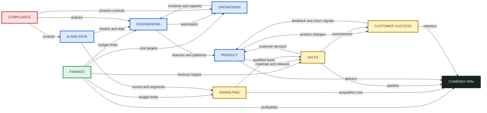

# Blast Radius - Canonical Architecture

> **Source of truth.** These two diagrams are authoritative and used strictly as given.
> Diagram A (master architecture) governs the system's structure end-to-end. Diagram B
> (department influence + KPI view) is the domain-interaction map. The build must not deviate
> from these; where the fixture is finer-grained than a diagram box, it rolls up into it
> (see the mapping at the bottom).

## Diagram A - Master architecture (6 stages)

```mermaid
flowchart LR

%% =====================================================
%% BLAST RADIUS - CLEAN MASTER ARCHITECTURE
%% =====================================================

GOAL["🎯 COMPANY OBJECTIVE<br/><br/><b>Reduce Cost by $2M</b><br/>Protect Revenue • Operations • Compliance"]


%% =====================================================
%% ORGANIZATION
%% =====================================================

subgraph ORG["1. ORGANIZATION"]
direction TB

FIN["💰 FINANCE / FP&A<br/><br/>Budget & Cost Targets<br/>Financial KPIs"]

ENG["🛠️ ENGINEERING / PRODUCT<br/><br/>Code & Product Systems<br/>Engineering Capacity"]

PLAT["⚙️ PLATFORM / INFRA OPS<br/><br/>Cloud & Production<br/>Billing • On-Call"]

DATA["🧠 AI / DATA<br/><br/>Data Pipelines<br/>ML Models • Analytics"]

SALES["📈 SALES / CUSTOMER SUCCESS<br/><br/>Customers • Revenue<br/>SLAs • Customer Workflows"]

PROC["📦 PROCUREMENT / VENDORS<br/><br/>Contracts • Licenses<br/>Renewals • Vendor Spend"]

PMO["📋 PMO / TRANSFORMATION<br/><br/>Strategic Projects<br/>Migrations • Programs"]

RISK["🛡️ RISK / COMPLIANCE<br/><br/>Controls • Auditability<br/>SOC2 • Regulatory"]

end


GOAL --> ORG


%% =====================================================
%% BUSINESS ASSETS
%% =====================================================

subgraph ASSETS["2. WHAT THE ORGANIZATION DEPENDS ON"]
direction TB

PEOPLE["👤 PEOPLE & OWNERSHIP<br/><br/>Who maintains the system"]

KNOW["🧠 CRITICAL KNOWLEDGE<br/><br/>Expertise • Tribal Knowledge"]

SYSTEMS["💻 SYSTEMS & SERVICES<br/><br/>Applications • Infrastructure<br/>Repositories • Data"]

WORK["🔄 BUSINESS WORKFLOWS<br/><br/>Processes that create<br/>business value"]

CONTROLS["🛡️ CONTROLS & REQUIREMENTS<br/><br/>Security • Compliance<br/>Audit • SLA"]

end


ORG --> ASSETS

PEOPLE --> KNOW
KNOW --> SYSTEMS
SYSTEMS --> WORK
WORK --> CONTROLS


%% =====================================================
%% DECISION
%% =====================================================

subgraph DECISION["3. EXECUTIVE DECISION"]
direction TB

CHANGE["❓ WHAT IF WE CHANGE SOMETHING?"]

C1["✂️ Reduce Platform Ops"]
C2["❌ Cancel Vendor"]
C3["⏸️ Stop Migration"]
C4["📉 Reduce Engineering"]

CHANGE --> C1
CHANGE --> C2
CHANGE --> C3
CHANGE --> C4

end


ASSETS --> CHANGE


%% =====================================================
%% CONSEQUENCES
%% =====================================================

subgraph CONSEQUENCE["4. BLAST RADIUS"]
direction TB

Q1["🔴 OWNERSHIP<br/><br/>Who becomes responsible?"]

Q2["🔴 TECHNICAL<br/><br/>What system or workflow<br/>is affected?"]

Q3["🔴 OPERATIONAL<br/><br/>What stops working,<br/>slows down, or degrades?"]

Q4["🔴 BUSINESS<br/><br/>Revenue • SLA •<br/>Customer Impact"]

Q5["🔴 COMPLIANCE<br/><br/>Which control,<br/>audit path, or requirement?"]

Q6["🔴 FINANCIAL<br/><br/>Savings vs.<br/>Unexpected Cost"]

Q1 --> Q2
Q2 --> Q3
Q3 --> Q4
Q3 --> Q5
Q4 --> Q6
Q5 --> Q6

end


CHANGE --> CONSEQUENCE


%% =====================================================
%% CONCRETE EXAMPLES
%% =====================================================

subgraph EXAMPLES["5. EXAMPLE CONSEQUENCE CHAINS"]
direction TB

E1["Platform Ops Cut<br/>↓<br/><b>Billing Workflow Loses Owner</b><br/>↓<br/>Orphaned Reconciliation"]

E2["Vendor Cancelled<br/>↓<br/><b>Audit-Log Data Removed</b><br/>↓<br/>Control Affected"]

E3["Migration Stopped<br/>↓<br/><b>Legacy Warehouse Remains</b><br/>↓<br/>Cost Continues"]

E4["Engineering Reduced<br/>↓<br/><b>Critical Maintenance Slows</b><br/>↓<br/>Customer Impact"]

end


CONSEQUENCE --> EXAMPLES


%% =====================================================
%% SIMULATION
%% =====================================================

SIM["🧮 BLAST RADIUS ENGINE<br/><br/><b>Trace Dependencies</b><br/>↓<br/>Detect Critical Failures<br/>↓<br/>Calculate Savings<br/>↓<br/>Calculate Downstream Loss<br/>↓<br/>Check Constraints<br/>↓<br/>Forecast 12-Month Rebound"]


EXAMPLES --> SIM


%% =====================================================
%% OUTPUT
%% =====================================================

subgraph OUTPUT["6. DECISION OUTPUT"]
direction TB

PLAN["✅ OPTIMIZED DECISION PLAN<br/><br/>Required Savings Achieved<br/>Critical Systems Protected<br/>Compliance Preserved<br/>Business Impact Within Limits"]

MIT["🔧 MITIGATION PLAN<br/><br/>Reassign Owner<br/>Document Runbook<br/>Reassign On-Call<br/>Replace / Renegotiate Vendor"]

VALUE["📊 12-MONTH VALUE<br/><br/><b>Net Savings</b><br/>− Transition Cost<br/>− Business Impact<br/>+ Avoided Failure Cost"]

PLAN --> MIT
PLAN --> VALUE

end


SIM --> OUTPUT


%% =====================================================
%% STYLING
%% =====================================================

classDef goal fill:#111827,color:#ffffff,stroke:#111827,stroke-width:3px

classDef org fill:#f3f4f6,color:#111827,stroke:#374151,stroke-width:2px

classDef asset fill:#e0f2fe,color:#111827,stroke:#0369a1,stroke-width:2px

classDef decision fill:#fef3c7,color:#111827,stroke:#b45309,stroke-width:2px

classDef consequence fill:#fee2e2,color:#111827,stroke:#dc2626,stroke-width:2px

classDef example fill:#fff7ed,color:#111827,stroke:#ea580c,stroke-width:2px

classDef engine fill:#ede9fe,color:#111827,stroke:#7c3aed,stroke-width:3px

classDef output fill:#dcfce7,color:#111827,stroke:#16a34a,stroke-width:3px


class GOAL goal

class FIN,ENG,PLAT,DATA,SALES,PROC,PMO,RISK org

class PEOPLE,KNOW,SYSTEMS,WORK,CONTROLS asset

class CHANGE,C1,C2,C3,C4 decision

class Q1,Q2,Q3,Q4,Q5,Q6 consequence

class E1,E2,E3,E4 example

class SIM engine

class PLAN,MIT,VALUE output
```

## Diagram B - Department influence + Company KPIs

## How the diagrams bind to the build (strict mapping)

**Diagram A is the contract.** Every box maps to a real part of the system:

| Diagram A element | Where it lives |
|---|---|
| Stage 1 ORG - 8 domains | `department` entities (domain view) |
| Stage 2 ASSETS - People/Knowledge/Systems/Workflows/Controls | `EntityKind`: person, knowledge, system, workflow, control |
| Stage 3 DECISION - C1..C4 | `Intervention` (reduce / remove / stop) |
| Stage 4 BLAST RADIUS - Q1..Q6 | `Impact.dimension`: ownership, technical, operational, business, compliance, financial |
| Stage 5 EXAMPLES - E1..E4 | the 4 planted traps in `data/synthetic_company.json` |
| Stage 5 ENGINE - SIM steps | `simulation-engine`: trace → detect → savings → downstream → constraints → 12-month rebound |
| Stage 6 OUTPUT - PLAN/MIT/VALUE | `ScenarioResult`, `MitigationComparison`, `ValueBreakdown` |

**Diagram A domain → fixture department roll-up** (fixture may be finer; it aggregates up):

| Diagram A domain | Fixture department id(s) |
|---|---|
| FINANCE / FP&A | `dept_finance` |
| ENGINEERING / PRODUCT | `dept_eng` |
| PLATFORM / INFRA OPS | `dept_platform` |
| AI / DATA | `dept_data` |
| SALES / CUSTOMER SUCCESS | `dept_sales` + `dept_cs` |
| PROCUREMENT / VENDORS | `dept_procurement` |
| PMO / TRANSFORMATION | `dept_pmo` |
| RISK / COMPLIANCE | `dept_risk` |

**Diagram B** is the department-influence + KPI view (Finance→budget limits→Eng, etc.). Per the
schema proposal this influence map is **not stored** as edges; the API renders it by aggregating
entity dependencies to domain level (`GET /company/graph?level=domain`). It uses a coarser, classic
department set (Product, Marketing, Operations shown separately) purely for the influence picture.
